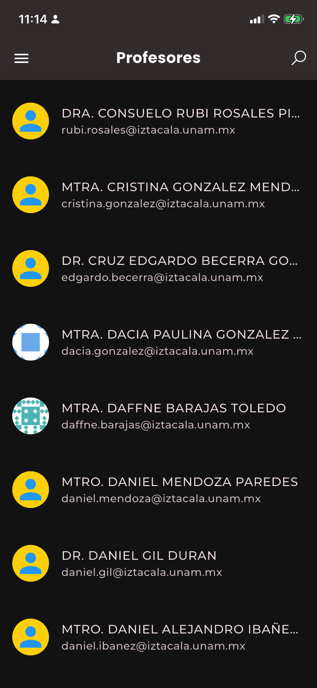
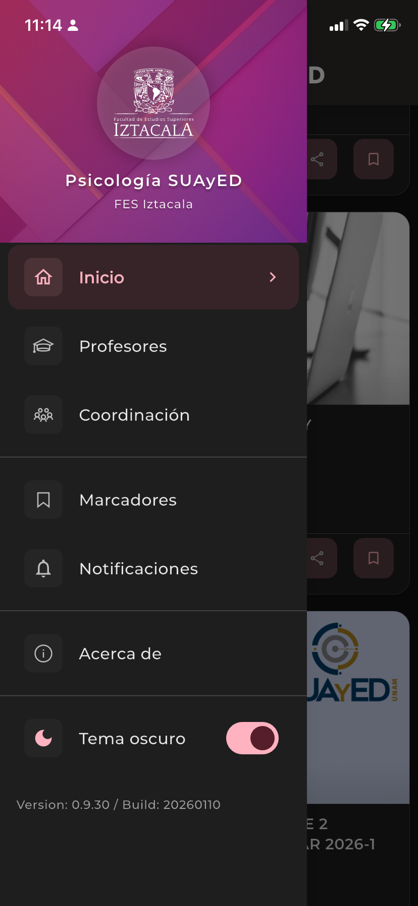

<div align="center">

# Psicología SUAyED - FES Iztacala


### Aplicación Móvil para la Comunidad de Psicología SUAyED

**Sistema Universidad Abierta y Educación a Distancia**
**Facultad de Estudios Superiores Iztacala, UNAM**

[](https://flutter.dev)
[](https://firebase.google.com)
[](https://github.com)
[](LICENSE)

</div>

---

## Tabla de Contenidos

- [Descripcion General](#descripcion-general)
- [Capturas de Pantalla](#capturas-de-pantalla)
- [Caracteristicas](#caracteristicas)
- [Requisitos del Sistema](#requisitos-del-sistema)
- [Instalacion](#instalacion)
- [Configuracion de Firebase](#configuracion-de-firebase)
- [Estructura del Proyecto](#estructura-del-proyecto)
- [Arquitectura](#arquitectura)
- [Comandos Utiles](#comandos-utiles)
- [Pruebas](#pruebas)
- [Contribucion](#contribucion)
- [Licencia](#licencia)
- [Creditos](#creditos)

---

## Descripción General

Esta aplicación está diseñada para mantener informados a los estudiantes de la carrera de Psicología del sistema SUAyED FES Iztacala. Proporciona acceso a noticias, eventos, calendario escolar con fechas importantes, información de profesores, áreas de conocimiento y permite guardar publicaciones importantes para consultarlas posteriormente.

La aplicación implementa una arquitectura moderna con gestión de estado mediante Provider, sistema de caché inteligente, soporte para temas claro/oscuro con cumplimiento WCAG AA/AAA, y servicios de Firebase para notificaciones push, analíticas y monitoreo de errores.

### Datos del Proyecto

| Atributo | Valor |
| -------- | ----- |
| **Versión** | 0.9.30+20260110 |
| **Flutter SDK** | ^3.9.2 |
| **Plataformas** | Android, iOS, macOS, Web |
| **Color Principal** | #d81b60 (Rosa Institucional UNAM) |
| **API Base** | https://suayed.iztacala.unam.mx/ |
| **Paquete** | `suayed` |

---

## Capturas de Pantalla

<div align="center">

### Pantallas Principales

| Pantalla Principal | Profesores | Áreas de Conocimiento |
|:------------------:|:----------:|:--------------------:|
|  |  |  |
| Vista de noticias con paginación | Catálogo de profesores | Áreas de conocimiento |

### Funcionalidades Adicionales

| Detalle de Noticia | Marcadores | Menú Lateral |
|:------------------:|:----------:|:------------:|
|  |  |  |
| Contenido HTML renderizado | Posts guardados para después | Navegación principal |

| Calendario Escolar |
|:------------------:|
|  |
| Eventos y fechas importantes del semestre |

</div>

---

## Características

### Funcionalidades Principales

- **📰 Noticias y Eventos**
  - Mantente al día con las últimas publicaciones y avisos de la carrera
  - Sistema de paginación para carga eficiente
  - Caché inteligente con persistencia de 7 días
  - Renderizado completo de contenido HTML/CSS desde WordPress

- **📅 Calendario Escolar**
  - Consulta eventos académicos organizados por semestre
  - Fechas importantes: inscripciones, exámenes, vacaciones
  - Búsqueda y filtrado por tipo de evento
  - Cache inteligente con funcionamiento offline (7 días)
  - Actualización manual con pull-to-refresh
  - Soporte para URLs externas (convocatorias, formularios)
  - Días inhábiles destacados

- **📚 Áreas de Conocimiento**
  - Explora las diferentes áreas de la psicología disponibles en el plan de estudios
  - Información detallada de cada área
  - Datos almacenados localmente para acceso offline

- **👨‍🏫 Planta Docente**
  - Consulta información sobre los profesores de la carrera
  - Datos de contacto (email, teléfono)
  - Avatares con Gravatar
  - Enlaces a perfiles institucionales

- **🔖 Marcadores**
  - Guarda publicaciones importantes para leerlas más tarde
  - Persistencia local con Localstore
  - Acceso rápido a contenido favorito
  - Sincronización automática

- **🔔 Notificaciones Push**
  - Recibe notificaciones importantes directamente en tu dispositivo
  - Firebase Cloud Messaging (FCM)
  - Historial de notificaciones
  - Soporte para notificaciones en segundo plano

- **🎨 Tema Claro/Oscuro**
  - Soporte completo para temas claro y oscuro
  - Cumplimiento WCAG AA/AAA para accesibilidad
  - Transiciones suaves (300ms con Curves.easeInOut)
  - Sistema tipográfico optimizado (Poppins + Montserrat)
  - Contraste de color calibrado para ambos modos

- **📊 Analíticas y Monitoreo**
  - Firebase Analytics para rastreo de eventos
  - Firebase Crashlytics para monitoreo de errores
  - Sistema de logging centralizado con AppLogger
  - Rastreo automático de navegación

- **ℹ️ Información Institucional**
  - Acerca de la aplicación
  - Créditos del proyecto
  - Aviso de privacidad
  - Enlaces a recursos institucionales

---

## Requisitos del Sistema

### Para Desarrollo

| Requisito | Versión Mínima | Notas |
| --------- | -------------- | ----- |
| Flutter SDK | 3.9.2 o superior | [Instalar Flutter](https://flutter.dev/docs/get-started/install) |
| Dart SDK | 3.9.2 o superior | Incluido con Flutter |
| Android Studio / VS Code | Última versión estable | Con plugins de Flutter/Dart |
| Xcode (para iOS/macOS) | 14.0 o superior | Solo macOS |
| Firebase CLI | Última versión | Para configuración de Firebase |
| Git | 2.0 o superior | Control de versiones |

### Para Dispositivos

| Plataforma | Versión Mínima | Notas |
| ---------- | -------------- | ----- |
| Android | API 21 (Android 5.0 Lollipop) | Soporte para la mayoría de dispositivos |
| iOS | 12.0 | iPhone 5s o superior |
| macOS | 10.14 (Mojave) | Para desarrollo y pruebas |
| Web | Navegadores modernos | Chrome, Firefox, Safari, Edge |

---

## Instalación

### Paso 1: Clonar el Repositorio

```bash
git clone <URL_DEL_REPOSITORIO>
cd psicologia_v4
```

### Paso 2: Verificar Instalación de Flutter

```bash
flutter doctor -v
```

Asegúrate de que no haya errores críticos antes de continuar. Todos los checks deben estar en verde (✓).

### Paso 3: Instalar Dependencias

```bash
flutter pub get
```

Este comando descargará todas las dependencias necesarias especificadas en `pubspec.yaml`.

### Paso 4: Configurar Firebase

Consulta la sección [Configuración de Firebase](#configuracion-de-firebase) para los pasos detallados.

### Paso 5: Ejecutar la Aplicación

```bash
# Listar dispositivos disponibles
flutter devices

# Ejecutar en modo debug (desarrollo)
flutter run

# Ejecutar en un dispositivo específico
flutter run -d <device_id>

# Ejecutar en modo release (producción)
flutter run --release

# Ejecutar con hot reload habilitado (por defecto en debug)
flutter run --hot
```

### Solución de Problemas Comunes

**Error: "Unable to locate Android SDK"**
```bash
# Configura la ruta de Android SDK
export ANDROID_HOME=$HOME/Library/Android/sdk  # macOS
export ANDROID_HOME=$HOME/Android/Sdk          # Linux
```

**Error: "CocoaPods not installed" (iOS/macOS)**
```bash
# Instala CocoaPods
sudo gem install cocoapods
cd ios && pod install
cd ../macos && pod install
```

**Error: "Waiting for another flutter command to release the startup lock"**
```bash
# Elimina el archivo de lock
rm -rf /Users/<usuario>/flutter/bin/cache/lockfile
```

---

## Configuración de Firebase

La aplicación utiliza Firebase para notificaciones push, analíticas y reporte de errores (Crashlytics).

### Proyecto Firebase

- **Nombre del Proyecto**: `app-de-psicologia-suayed`
- **Región**: us-central1
- **Plan**: Spark (gratuito con límites)

### Archivos de Configuración Requeridos

| Plataforma | Archivo | Ubicación | Estado |
| ---------- | ------- | --------- | ------ |
| Android | `google-services.json` | `android/app/` | Requerido |
| iOS | `GoogleService-Info.plist` | `ios/Runner/` | Requerido |
| macOS | `GoogleService-Info.plist` | `macos/Runner/` | Requerido |
| Dart | `firebase_options.dart` | `lib/` | Auto-generado |

### Pasos para Configurar Firebase

#### Opción 1: Usando FlutterFire CLI (Recomendado)

```bash
# Instala FlutterFire CLI
dart pub global activate flutterfire_cli

# Configura Firebase (interactivo)
flutterfire configure

# Selecciona el proyecto: app-de-psicologia-suayed
# Selecciona las plataformas: Android, iOS, macOS
```

Este comando:
- Descarga automáticamente los archivos de configuración
- Los coloca en las ubicaciones correctas
- Genera `lib/firebase_options.dart`

#### Opción 2: Configuración Manual

1. **Accede a la Consola de Firebase**
   - Ve a [console.firebase.google.com](https://console.firebase.google.com)
   - Selecciona el proyecto `app-de-psicologia-suayed`

2. **Descarga los Archivos de Configuración**

   **Para Android:**
   - Ve a Project Settings > General
   - Descarga `google-services.json`
   - Colócalo en `android/app/`

   **Para iOS:**
   - Ve a Project Settings > General
   - Descarga `GoogleService-Info.plist`
   - Colócalo en `ios/Runner/`

   **Para macOS:**
   - Usa el mismo archivo de iOS
   - Colócalo en `macos/Runner/`

3. **Regenerar firebase_options.dart**
   ```bash
   flutterfire configure
   ```

### Servicios de Firebase Utilizados

| Servicio | Paquete | Versión | Descripción |
| -------- | ------- | ------- | ----------- |
| **Core** | `firebase_core` | 4.2.0 | Núcleo de Firebase (requerido) |
| **Analytics** | `firebase_analytics` | 12.0.3 | Analíticas de eventos y navegación |
| **Messaging** | `firebase_messaging` | 16.0.3 | Notificaciones push FCM |
| **Crashlytics** | `firebase_crashlytics` | 5.0.6 | Monitoreo y reporte de errores |

### Inicialización en la Aplicación

La aplicación inicializa Firebase automáticamente en `main.dart`:

```dart
await Firebase.initializeApp(
  options: DefaultFirebaseOptions.currentPlatform,
);
```

Los servicios se inicializan en el siguiente orden:
1. Hive (base de datos local)
2. HTTP Service (cliente Dio con caché)
3. AppFonts (precarga de fuentes)
4. Firebase Core + Analytics + Messaging
5. Crashlytics

### Verificación de Configuración

Para verificar que Firebase está configurado correctamente:

```bash
# Ejecuta la aplicación en modo debug
flutter run

# Verifica los logs de inicialización
# Deberías ver: "Firebase initialized successfully"
```

### Notas Importantes

- Los archivos `google-services.json` y `GoogleService-Info.plist` **no deben** incluirse en el control de versiones por razones de seguridad
- Estos archivos ya están en `.gitignore`
- Para producción, usa Firebase App Distribution o CI/CD para inyectar las configuraciones

---

## Estructura del Proyecto

```
psicologia_v4/
├── lib/
│   ├── main.dart                 # Punto de entrada de la aplicación
│   ├── theme.dart                # Configuración de temas (claro/oscuro)
│   ├── firebase_options.dart     # Configuración de Firebase (auto-generado)
│   │
│   ├── models/                   # Modelos de datos
│   │   ├── post_model.dart       # Modelo para noticias/posts
│   │   ├── storage_post_model.dart # Modelo para almacenamiento local
│   │   ├── area_model.dart       # Modelo para áreas de conocimiento
│   │   ├── teacher_model.dart    # Modelo para profesores
│   │   ├── notification_model.dart # Modelo para notificaciones
│   │   └── calendario_model.dart # Modelos para calendario escolar
│   │
│   ├── providers/                # Gestión de estado (Provider)
│   │   ├── home_provider.dart    # Estado de la pantalla principal
│   │   ├── bookmark_provider.dart # Estado de marcadores
│   │   ├── notification_provider.dart # Estado de notificaciones
│   │   └── theme_provider.dart   # Estado del tema (claro/oscuro)
│   │
│   ├── services/                 # Capa de servicios
│   │   ├── http_service.dart     # Cliente HTTP con caché (Dio)
│   │   ├── posts_service.dart    # Servicio de posts con paginación
│   │   ├── suayed_service.dart   # Operaciones de API de alto nivel
│   │   ├── calendario_service.dart # Servicio de calendario escolar
│   │   ├── local_service.dart    # Almacenamiento local
│   │   ├── firebase_service.dart # Inicialización de Firebase
│   │   ├── crashlytics_service.dart # Reporte de errores
│   │   └── logger_service.dart   # Sistema de logging centralizado
│   │
│   ├── screens/                  # Pantallas de la aplicación
│   │   ├── home_screen.dart      # Pantalla principal (noticias)
│   │   ├── post_detail.dart      # Detalle de noticia
│   │   ├── teachers_screen.dart  # Lista de profesores
│   │   ├── teacher_detail.dart   # Detalle de profesor
│   │   ├── areas_screen.dart     # Áreas de conocimiento
│   │   ├── area_detail.dart      # Detalle de área
│   │   ├── calendario_screen.dart # Pantalla de calendario escolar
│   │   ├── bookmarks_screen.dart # Marcadores guardados
│   │   ├── notifications_screen.dart # Pantalla de notificaciones
│   │   ├── about_screen.dart     # Acerca de la app
│   │   ├── credits_screen.dart   # Créditos
│   │   └── privacy_notice.dart   # Aviso de privacidad
│   │
│   ├── widgets/                  # Componentes reutilizables
│   │   ├── app_drawer.dart       # Menú lateral de navegación
│   │   ├── post_card.dart        # Tarjeta de noticia
│   │   ├── avatar.dart           # Avatar de usuario
│   │   ├── thumbnail_image.dart  # Imagen miniatura
│   │   ├── shimmer_placeholder.dart # Placeholder de carga
│   │   ├── empty_state.dart      # Estado vacío
│   │   └── show_snack_bar.dart   # Notificaciones en pantalla
│   │
│   ├── routes/                   # Navegación
│   │   └── routes.dart           # Definición de rutas
│   │
│   └── utils/                    # Utilidades
│       ├── app_constants.dart    # Constantes de la aplicación
│       ├── analytics.dart        # Servicio centralizado de Firebase Analytics
│       ├── url_launcher_utils.dart # Utilidades para abrir URLs
│       └── url_validator.dart    # Validación de URLs
│
├── assets/                       # Recursos estáticos
│   ├── images/                   # Imágenes
│   │   └── no_image.jpg          # Placeholder de imagen
│   ├── icon/                     # Iconos de la aplicación
│   │   ├── icon.png              # Icono principal
│   │   └── apple.png             # Icono para iOS
│   ├── areas.json                # Datos de áreas de conocimiento (fallback)
│   ├── teachers.json             # Datos de profesores (fallback)
│   └── privacity.html            # Aviso de privacidad HTML
│
├── docs/                         # Documentación
│   ├── screenshots/              # Capturas de pantalla
│   │   ├── home.png              # Pantalla principal
│   │   ├── teachers.png          # Pantalla de profesores
│   │   ├── areas.png             # Pantalla de áreas
│   │   ├── detail.png            # Detalle de noticia
│   │   ├── ookmarks.png          # Pantalla de marcadores
│   │   └── drawer.png            # Menú lateral
│   └── ...                       # Documentación adicional
│
├── test/                         # Pruebas unitarias
│   ├── models/                   # Tests de modelos
│   │   ├── post_model_test.dart
│   │   └── storage_post_model_test.dart
│   ├── providers/                # Tests de providers
│   │   ├── bookmark_provider_test.dart
│   │   ├── home_provider_test.dart
│   │   ├── notification_provider_test.dart
│   │   └── theme_provider_test.dart
│   └── services/                 # Tests de servicios
│       └── http_service_test.dart
│
├── android/                      # Configuración de Android
│   └── app/
│       ├── build.gradle          # Configuración de Gradle
│       └── google-services.json  # Firebase (no versionado)
│
├── ios/                          # Configuración de iOS
│   └── Runner/
│       ├── Info.plist            # Configuración de iOS
│       └── GoogleService-Info.plist # Firebase (no versionado)
│
├── macos/                        # Configuración de macOS
│   └── Runner/
│       ├── Info.plist            # Configuración de macOS
│       └── GoogleService-Info.plist # Firebase (no versionado)
│
├── web/                          # Configuración de Web
│   ├── index.html                # HTML principal
│   └── manifest.json             # Web manifest
│
├── .gitignore                    # Archivos ignorados por Git
├── pubspec.yaml                  # Dependencias del proyecto
├── analysis_options.yaml         # Configuración del linter
├── CLAUDE.md                     # Guía para Claude Code
├── CONTRIBUTING.md               # Guía de contribución
└── README.md                     # Este archivo
```

---

## Arquitectura

La aplicación implementa una arquitectura en capas con separación clara de responsabilidades, siguiendo el patrón **Provider** para gestión de estado y principios de **Clean Architecture**.

### Patrón de Arquitectura

```
┌─────────────────────────────────────────────────────────────┐
│                        UI Layer                              │
│  ┌─────────────┐  ┌─────────────┐  ┌─────────────────────┐  │
│  │   Screens   │  │   Widgets   │  │       Routes        │  │
│  └──────┬──────┘  └──────┬──────┘  └──────────┬──────────┘  │
│         │                │                     │             │
└─────────┼────────────────┼─────────────────────┼─────────────┘
          │                │                     │
          ▼                ▼                     ▼
┌─────────────────────────────────────────────────────────────┐
│                     State Layer (Provider)                   │
│  ┌──────────────┐  ┌──────────────┐  ┌──────────────────┐   │
│  │ HomeProvider │  │BookmarkProv. │  │ NotificationProv │   │
│  └──────┬───────┘  └──────┬───────┘  └────────┬─────────┘   │
│         │                 │                    │             │
└─────────┼─────────────────┼────────────────────┼─────────────┘
          │                 │                    │
          ▼                 ▼                    ▼
┌─────────────────────────────────────────────────────────────┐
│                      Service Layer                           │
│  ┌──────────┐  ┌──────────┐  ┌──────────┐  ┌────────────┐   │
│  │HttpServ. │  │LocalServ.│  │FirebaseSv│  │PostsService│   │
│  └────┬─────┘  └────┬─────┘  └────┬─────┘  └─────┬──────┘   │
│       │             │             │              │           │
└───────┼─────────────┼─────────────┼──────────────┼───────────┘
        │             │             │              │
        ▼             ▼             ▼              ▼
┌─────────────────────────────────────────────────────────────┐
│                      Data Layer                              │
│  ┌──────────┐  ┌──────────┐  ┌──────────┐  ┌────────────┐   │
│  │ REST API │  │  Hive DB │  │ Firebase │  │Localstore  │   │
│  └──────────┘  └──────────┘  └──────────┘  └────────────┘   │
└─────────────────────────────────────────────────────────────┘
```

### Gestion de Estado

Se utiliza **Provider** con el patron `ChangeNotifier`:

```dart
// Ejemplo de uso en un widget
Consumer<HomeProvider>(
  builder: (context, provider, child) {
    if (provider.isLoading) {
      return CircularProgressIndicator();
    }
    return ListView.builder(
      itemCount: provider.posts.length,
      itemBuilder: (context, index) => PostCard(post: provider.posts[index]),
    );
  },
)
```

### Sistema de Caché HTTP

El cliente HTTP (Dio) implementa un sistema de caché inteligente con las siguientes características:

| Característica | Configuración |
| -------------- | ------------- |
| **Almacenamiento** | HiveCacheStore (persistente en disco) |
| **Política** | Request-level caching con max-stale |
| **Duración** | 7 días máximo |
| **Timeout de Conexión** | 5 segundos |
| **Timeout de Recepción** | 3 segundos |
| **Interceptores** | DioCacheInterceptor + LoggingInterceptor |
| **Métodos cacheados** | GET (POST no se cachea) |
| **Cifrado** | Deshabilitado (datos públicos) |

**Flujo de Caché:**

```
Request → Cache Check → ¿Existe y válido? → Retorna desde caché
                              ↓ No
                        API Request → Guarda en Hive → Retorna datos
```

### Sistema Tipográfico

La aplicación utiliza un sistema tipográfico optimizado con fuentes precargadas:

| Característica | Detalles |
| -------------- | -------- |
| **Fuentes Principales** | Poppins (títulos) + Montserrat (cuerpo) |
| **Precarga** | Al inicio de la app para mejor rendimiento offline |
| **Jerarquía** | Material Design 3 (displayLarge a labelSmall) |
| **Line Height** | 1.12-1.5 optimizado para legibilidad |
| **Accesibilidad** | WCAG AAA (ratio ≥ 7:1) para textos principales |
| **Temas** | Claro y oscuro con colores calibrados |

### Analíticas y Monitoreo

| Servicio | Funcionalidad | Implementación |
| -------- | ------------- | -------------- |
| **Firebase Analytics** | Rastreo de eventos y navegación | `lib/utils/analytics.dart` |
| **Firebase Crashlytics** | Monitoreo de errores en producción | `lib/services/crashlytics_service.dart` |
| **AppLogger** | Sistema de logging centralizado | `lib/services/logger_service.dart` |
| **Navigation Observer** | Rastreo automático de navegación | `Analytics.observer` en routes |

**Eventos rastreados:**
- Navegación entre pantallas
- Búsquedas
- Visualización de contenido
- Bookmarks añadidos/eliminados
- Notificaciones abiertas
- Compartir contenido
- Errores de aplicación

---

## Comandos Útiles

### Desarrollo

```bash
# Instalar dependencias
flutter pub get

# Ejecutar en modo debug (con hot reload)
flutter run

# Ejecutar en modo debug con verbose
flutter run -v

# Ejecutar en modo release
flutter run --release

# Ejecutar en modo profile (para análisis de rendimiento)
flutter run --profile

# Limpiar caché de build
flutter clean

# Limpiar y reinstalar dependencias
flutter clean && flutter pub get

# Verificar estado de Flutter
flutter doctor -v
```

### Construcción (Build)

```bash
# Android APK (release)
flutter build apk --release

# Android APK (split por ABI para menor tamaño)
flutter build apk --split-per-abi

# Android App Bundle (para Google Play Store)
flutter build appbundle --release

# iOS (requiere macOS y Xcode)
flutter build ios --release

# macOS (requiere macOS)
flutter build macos --release

# Web (para deployment)
flutter build web --release

# Web con configuración específica
flutter build web --web-renderer canvaskit --release
```

### Generación de Assets

```bash
# Generar iconos de la aplicación
dart run flutter_launcher_icons:generate -f flutter_launcher_icons.yaml

# Generar splash screen
dart run flutter_native_splash:create --path=flutter_native_splash.yaml

# Regenerar ambos
dart run flutter_launcher_icons:generate -f flutter_launcher_icons.yaml && \
dart run flutter_native_splash:create --path=flutter_native_splash.yaml
```

### Análisis de Código

```bash
# Ejecutar linter
dart analyze

# Ejecutar linter con más detalles
dart analyze --verbose

# Formatear código
dart format lib/

# Formatear y sobrescribir archivos
dart format lib/ -w

# Verificar dependencias desactualizadas
flutter pub outdated

# Actualizar dependencias menores
flutter pub upgrade

# Actualizar dependencias mayores (con precaución)
flutter pub upgrade --major-versions
```

### Pruebas (Testing)

```bash
# Ejecutar todas las pruebas
flutter test

# Ejecutar con cobertura
flutter test --coverage

# Generar reporte HTML de cobertura (requiere lcov)
genhtml coverage/lcov.info -o coverage/html
open coverage/html/index.html  # macOS
xdg-open coverage/html/index.html  # Linux

# Ejecutar una prueba específica
flutter test test/providers/home_provider_test.dart

# Ejecutar pruebas de un directorio
flutter test test/providers/

# Ejecutar con verbose
flutter test --verbose
```

### Firebase

```bash
# Instalar FlutterFire CLI
dart pub global activate flutterfire_cli

# Configurar Firebase (interactivo)
flutterfire configure

# Verificar configuración
firebase projects:list
```

### Depuración (Debug)

```bash
# Ver logs en tiempo real
flutter logs

# Ver logs con filtro
flutter logs | grep "MyTag"

# Inspeccionar dispositivos
flutter devices -v

# Conectar a DevTools
flutter pub global activate devtools
flutter pub global run devtools
```

### Utilidades

```bash
# Ver información del proyecto
flutter --version

# Listar todos los dispositivos
flutter devices

# Capturar screenshot de la app en ejecución
flutter screenshot

# Generar código de l10n (si se usa internacionalización)
flutter gen-l10n
```

---

## Pruebas

El proyecto incluye pruebas unitarias para modelos, providers y servicios.

### Estructura de Pruebas

```
test/
├── models/
│   ├── post_model_test.dart
│   └── storage_post_model_test.dart
├── providers/
│   ├── bookmark_provider_test.dart
│   ├── home_provider_test.dart
│   ├── notification_provider_test.dart
│   └── theme_provider_test.dart
└── services/
    └── http_service_test.dart
```

### Ejecutar Pruebas

```bash
# Todas las pruebas
flutter test

# Con cobertura
flutter test --coverage

# Generar reporte HTML (requiere lcov)
genhtml coverage/lcov.info -o coverage/html
open coverage/html/index.html
```

---

## Contribución

Por favor, lee el archivo [CONTRIBUTING.md](CONTRIBUTING.md) para conocer las directrices detalladas de contribución.

### Resumen Rápido

1. **Fork el repositorio**
   ```bash
   git clone <URL_DEL_FORK>
   cd psicologia_v4
   ```

2. **Crea una rama para tu feature**
   ```bash
   git checkout -b feature/mi-nueva-caracteristica
   ```

3. **Realiza tus cambios siguiendo las convenciones del proyecto**
   - Revisa [CLAUDE.md](CLAUDE.md) para guías de estilo y convenciones
   - Usa los patrones establecidos en el proyecto
   - Escribe código en español (comentarios, mensajes de error, etc.)

4. **Escribe pruebas para tu código**
   ```bash
   # Crear pruebas en test/
   flutter test test/tu_nueva_prueba.dart
   ```

5. **Asegúrate de que todas las pruebas pasen**
   ```bash
   flutter test
   dart analyze
   dart format lib/ -w
   ```

6. **Haz commit de tus cambios**
   ```bash
   # Usa conventional commits:
   # feat: para nuevas características
   # fix: para correcciones de bugs
   # docs: para documentación
   # style: para cambios de formato
   # refactor: para refactorización
   # test: para pruebas
   # chore: para tareas de mantenimiento

   git add .
   git commit -m 'feat: agrega nueva característica'
   ```

7. **Push a la rama**
   ```bash
   git push origin feature/mi-nueva-caracteristica
   ```

8. **Abre un Pull Request**
   - Describe claramente los cambios realizados
   - Incluye capturas de pantalla si aplica
   - Referencia issues relacionados

### Convenciones de Código

| Tipo | Convención | Ejemplo |
| ---- | ---------- | ------- |
| Archivos | snake_case | `home_screen.dart` |
| Clases | PascalCase | `HomeScreen` |
| Variables | camelCase | `isLoading` |
| Constantes | camelCase o SCREAMING_SNAKE_CASE | `maxPostsInMemory` |
| Métodos privados | _camelCase | `_buildTheme()` |

### Checklist de Pull Request

- [ ] El código sigue las convenciones del proyecto
- [ ] Se agregaron pruebas para el nuevo código
- [ ] Todas las pruebas pasan (`flutter test`)
- [ ] El linter no muestra errores (`dart analyze`)
- [ ] El código está formateado (`dart format lib/ -w`)
- [ ] La documentación está actualizada
- [ ] Los commits siguen el formato conventional commits

---

## Licencia

Este proyecto es software propietario desarrollado para la **Universidad Nacional Autónoma de México (UNAM)**, Facultad de Estudios Superiores Iztacala.

### Derechos Reservados

© 2024-2026 UNAM FES Iztacala - Sistema SUAyED Psicología

Todos los derechos reservados. El uso, modificación o distribución de este software está sujeto a las políticas institucionales de la UNAM.

---

## Créditos

### Desarrollo Institucional

| Atributo | Detalles |
| -------- | -------- |
| **Institución** | Universidad Nacional Autónoma de México (UNAM) |
| **Facultad** | Facultad de Estudios Superiores Iztacala |
| **Sistema** | Sistema Universidad Abierta y Educación a Distancia (SUAyED) |
| **Carrera** | Licenciatura en Psicología |
| **Año** | 2024-2026 |

### Stack Tecnológico

#### Framework y Lenguajes

| Tecnología | Versión | Uso |
| ---------- | ------- | --- |
| [Flutter](https://flutter.dev/) | 3.9.2+ | Framework de desarrollo multiplataforma |
| [Dart](https://dart.dev/) | 3.9.2+ | Lenguaje de programación |
| [Material Design 3](https://m3.material.io/) | Latest | Sistema de diseño |

#### Servicios Backend

| Servicio | Versión | Uso |
| -------- | ------- | --- |
| [Firebase Core](https://firebase.google.com/) | 4.2.0 | Plataforma backend |
| [Firebase Analytics](https://firebase.google.com/products/analytics) | 12.0.3 | Analíticas y métricas |
| [Firebase Messaging](https://firebase.google.com/products/cloud-messaging) | 16.0.3 | Notificaciones push |
| [Firebase Crashlytics](https://firebase.google.com/products/crashlytics) | 5.0.6 | Monitoreo de errores |

#### Networking y Caché

| Paquete | Versión | Uso |
| ------- | ------- | --- |
| [Dio](https://pub.dev/packages/dio) | 5.9.0 | Cliente HTTP con interceptores |
| [dio_cache_interceptor](https://pub.dev/packages/dio_cache_interceptor) | 4.0.5 | Sistema de caché HTTP |
| [cached_network_image](https://pub.dev/packages/cached_network_image) | 3.1.0 | Caché de imágenes |

#### Gestión de Estado y Persistencia

| Paquete | Versión | Uso |
| ------- | ------- | --- |
| [Provider](https://pub.dev/packages/provider) | 6.1.2 | Gestión de estado reactivo |
| [Hive](https://pub.dev/packages/hive) | 2.2.3 | Base de datos NoSQL local |
| [Localstore](https://pub.dev/packages/localstore) | 1.3.1 | Persistencia JSON para marcadores |

#### UI y UX

| Paquete | Versión | Uso |
| ------- | ------- | --- |
| [google_fonts](https://pub.dev/packages/google_fonts) | 7.0.0 | Tipografía (Poppins + Montserrat) |
| [shimmer](https://pub.dev/packages/shimmer) | 3.0.0 | Placeholders animados |
| [flutter_widget_from_html_core](https://pub.dev/packages/flutter_widget_from_html_core) | 0.17.0 | Renderizado de HTML |

#### Utilidades

| Paquete | Versión | Uso |
| ------- | ------- | --- |
| [share_plus](https://pub.dev/packages/share_plus) | 12.0.0 | Compartir contenido |
| [url_launcher](https://pub.dev/packages/url_launcher) | 6.3.2 | Abrir URLs externas |
| [logger](https://pub.dev/packages/logger) | 2.6.2 | Sistema de logging |
| [package_info_plus](https://pub.dev/packages/package_info_plus) | 9.0.0 | Información de la app |

---

## Contacto y Soporte

### Reportar Problemas

Para reportar problemas, bugs o sugerencias:

1. **Issues de GitHub**: Abre un issue en el repositorio
2. **Pull Requests**: Contribuye directamente al proyecto (ver [CONTRIBUTING.md](CONTRIBUTING.md))

### Información Institucional

- **Sitio Web SUAyED**: [https://suayed.iztacala.unam.mx/](https://suayed.iztacala.unam.mx/)
- **FES Iztacala**: [https://www.iztacala.unam.mx/](https://www.iztacala.unam.mx/)
- **UNAM**: [https://www.unam.mx/](https://www.unam.mx/)

---

## Roadmap

### Funcionalidades Completadas

- [x] Sistema de noticias y eventos con paginación
- [x] Caché inteligente con persistencia de 7 días
- [x] Sistema de marcadores (bookmarks)
- [x] Notificaciones push con FCM
- [x] Tema claro/oscuro con WCAG AA/AAA
- [x] Sistema tipográfico optimizado
- [x] Analíticas con Firebase Analytics
- [x] Monitoreo de errores con Crashlytics
- [x] Información de profesores y áreas

### Próximas Versiones

#### Versión 0.10.0 (Q1 2026)
- [ ] Enlaces a sitios de importancia para los alumnos
- [x] Calendario escolar interactivo
- [ ] Pantalla de notificaciones mejorada con categorías
- [ ] Sistema de búsqueda avanzada

#### Versión 0.11.0 (Q2 2026)
- [ ] Soporte multiidioma (Español, Inglés)
- [ ] Pantalla de videos educativos
- [ ] Sistema de favoritos por categorías
- [ ] Modo offline mejorado

#### Versión 1.0.0 (Q3 2026)
- [ ] Asistente virtual con IA
- [ ] Sistema de autenticación de usuarios
- [ ] Perfil de estudiante personalizado
- [ ] Integración con sistema académico

### Ideas Futuras
- [ ] Widget de escritorio para iOS/Android
- [ ] Soporte para tablets con UI adaptativa
- [ ] Sistema de comentarios en noticias
- [ ] Integración con calendario del dispositivo
- [ ] Modo de lectura optimizado

---

<div align="center">

## Desarrollado con Flutter para la Comunidad SUAyED


**Universidad Nacional Autónoma de México**
**Facultad de Estudios Superiores Iztacala**
**Sistema Universidad Abierta y Educación a Distancia (SUAyED)**

---

**Versión 0.9.30** | **Enero 2026**

[](https://flutter.dev)
[](https://firebase.google.com)
[](https://www.iztacala.unam.mx/)

</div>
